# 🚀 AWS Cloud Cost Optimization & Monitoring Dashboard

 
 


---

## 🌟 Project Overview
The **AWS Cloud Cost Optimization & Monitoring Dashboard** is a project that helps organizations:

- **Monitor**, **analyze**, and **optimize AWS cloud spending**  
- Gain **real-time insights** into costs across AWS services and regions  
- Identify **cost-saving opportunities** and reduce unnecessary expenses  

> This project provides a complete **dashboard and automated reporting system** for cloud cost management.

---

## 💡 Features
- **Real-time Cost Monitoring**: Track costs by service, account, and region  
- **Cost Alerts**: Notifications via **AWS SNS** when usage exceeds thresholds  
- **Data Visualization**: Interactive charts and dashboards using **QuickSight**  
- **Automated Reporting**: Export cost reports in **CSV**  
- **Optimization Insights**: Detect idle or underutilized resources for cost savings  

---

## 🛠 Technologies Used

| Category | Tools / Services |
|----------|-----------------|
| **Cloud** | AWS Lambda, AWS Cost Explorer API, AWS SNS, AWS S3, Amazon EventBridge|
| **Programming** | Python (Boto3) |
| **Visualization** | AWS QuickSight |

---

## ⚙ How It Works
1. **Data Collection:** AWS Lambda fetches cost data from **AWS Cost Explorer**  
2. **Data Storage:** Cost data is stored in **S3 buckets** for historical tracking  
3. **Data Processing:** Python scripts aggregate and process the data  
4. **Visualization:** Interactive dashboards display trends and usage patterns  
5. **Alerts:** AWS SNS notifies stakeholders if costs exceed predefined thresholds  

---

## 📈 Benefits
- Reduce unnecessary AWS spending  
- Gain **full visibility** into cloud usage  
- Enable **data-driven decisions** for optimization  
- Automate cost monitoring and reporting  

---

## 📝 Setup Instructions

 ## Full Steps ##
```bash
Enable AWS Cost Explorer from the Billing Dashboard.
```
**1.Create an S3 bucket to store cost reports.**
---
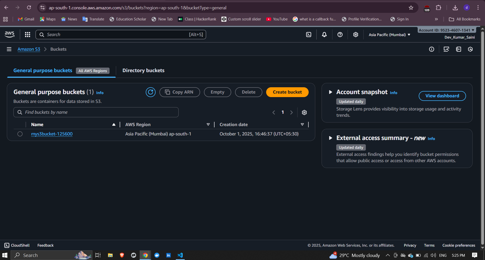

**2. Create an SNS topic for cost alerts.**
---
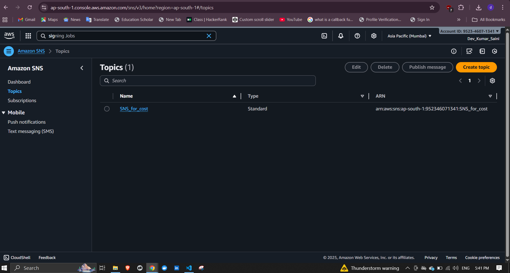

**3.Create an SNS Subscription for cost alerts.**
---
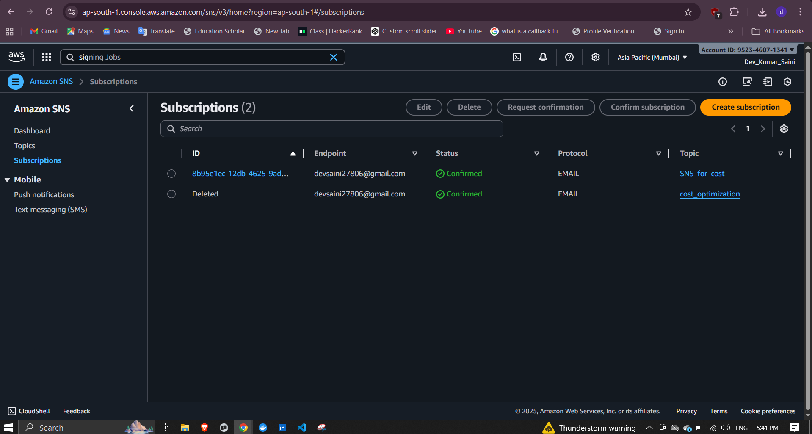

**4.Create an SNS Subscription Confirm on Email for cost alerts.**
---
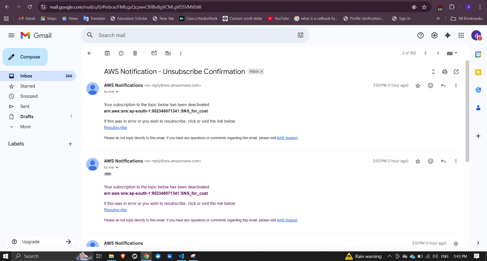

**5. Create an Lambda function for fetch cost Explore data and store in S3 ad send success message on email by SNS**
---
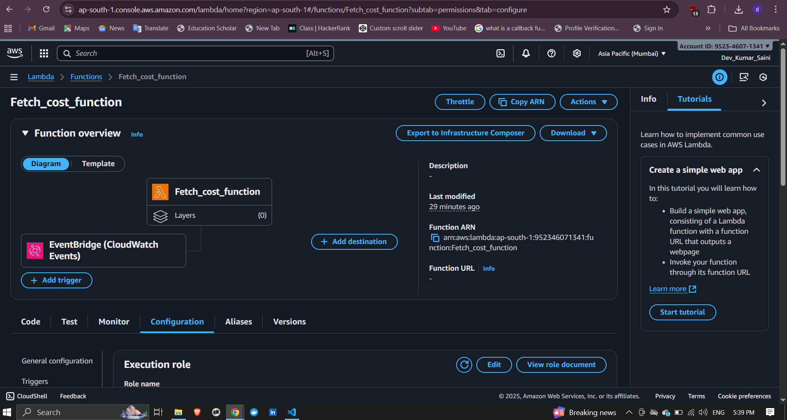

**6. Add EventBridge (CloudWatch Events): triggerFunction**
---


---

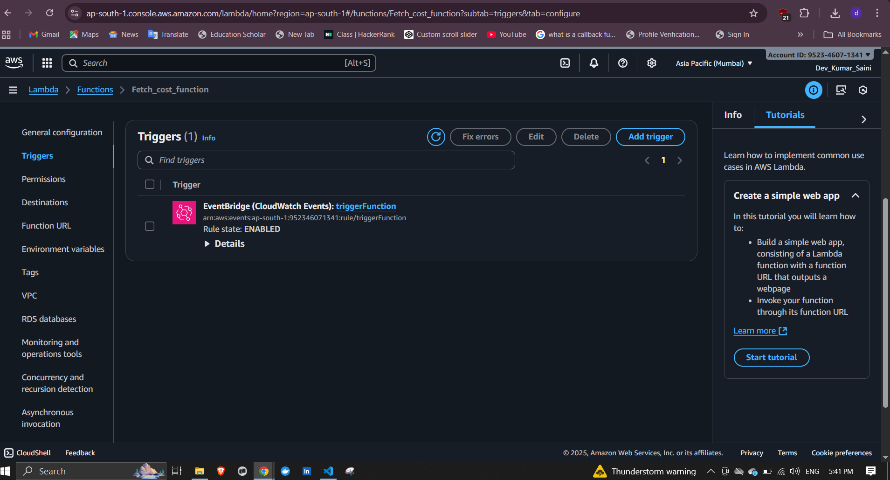

**7.Write a Python script on Lambda code Editor using Boto3 to fetch GetCostAndUsage from AWS Cost Explorer.**
---
```bash
import boto3
import csv
from io import StringIO
from datetime import datetime, timedelta
import json

def lambda_handler(event, context):
    # AWS clients
    ce = boto3.client('ce', region_name='us-east-1')  # Cost Explorer only works in us-east-1
    s3 = boto3.client('s3')
    sns = boto3.client('sns')

    # Last 7 days
    start = (datetime.today() - timedelta(days=7)).strftime('%Y-%m-%d')
    end = datetime.today().strftime('%Y-%m-%d')

    # Fetch daily cost per service
    response = ce.get_cost_and_usage(
        TimePeriod={'Start': start, 'End': end},
        Granularity='DAILY',
        Metrics=['UnblendedCost'],
        GroupBy=[{'Type': 'DIMENSION', 'Key': 'SERVICE'}]
    )

    # Prepare results & detect high-cost services
    results = []
    high_cost_services = []

    for day in response['ResultsByTime']:
        date = day['TimePeriod']['Start']
        for group in day['Groups']:
            service = group['Keys'][0]
            amount = float(group['Metrics']['UnblendedCost']['Amount'])
            results.append({'Date': date, 'Service': service, 'Amount': amount})
            if amount > 2:  # Threshold for high-cost
                high_cost_services.append({'Date': date, 'Service': service, 'Amount': amount})

    # Save CSV to S3
    csv_buffer = StringIO()
    writer = csv.DictWriter(csv_buffer, fieldnames=['Date', 'Service', 'Amount'])
    writer.writeheader()
    writer.writerows(results)    
```

**8.In the Lambda function, add code to save the cost data as CSV in S3**
```bash
  bucket_name = 'mys3bucket-125600'
    file_name = f"cost_report_{datetime.today().strftime('%Y-%m-%d')}.csv"
    s3.put_object(Bucket=bucket_name, Key=file_name, Body=csv_buffer.getvalue())
```
**9.In Lambda, add SNS notification when cost exceeds a threshold:**
```bash
 # SNS notification
    topic_arn = "arn:aws:sns:ap-south-1:952346071341:cost_optimization"
    
    # General report notification
    sns.publish(
        TopicArn=topic_arn,
        Subject="AWS Cost Report Generated",
        Message=f"The AWS cost report for the last 7 days has been successfully generated and saved to S3: s3://{bucket_name}/{file_name}"
    )

    # High-cost alert notification
    if high_cost_services:
        message = "⚠️ High Cost Alert for AWS Services (>$50):\n"
        for svc in high_cost_services:
            message += f"- {svc['Service']} on {svc['Date']}: ${svc['Amount']:.2f}\n"
        sns.publish(
            TopicArn=topic_arn,
            Subject="AWS High-Cost Service Alert",
            Message=message
        )

    print(f"Saved results to s3://{bucket_name}/{file_name} and notified SNS")
    return results
```
**10.After Written Lambda function go to Configure and check your lambda function Role name**
---
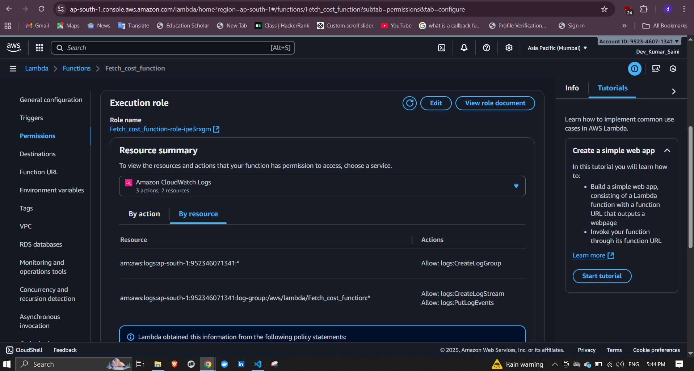

**11.Copy the Role name and go to IAM Roles and find your role**
---
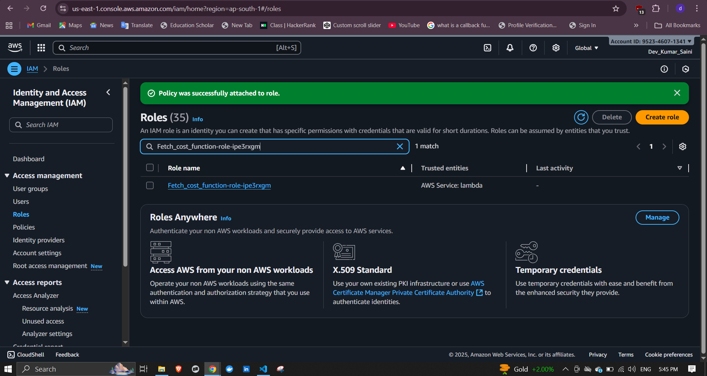

**12.Now open role and give all this permission to your lambda function**
---
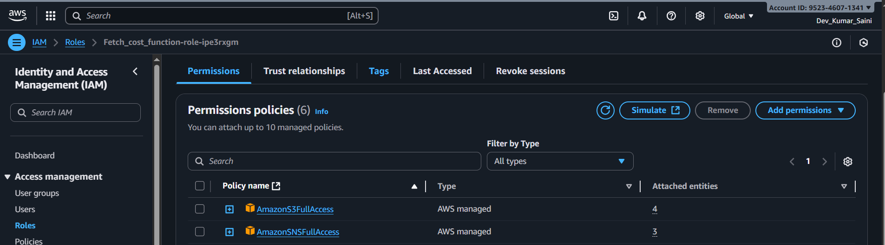

**Add this permission by inline policy to get cost and usage access**
---
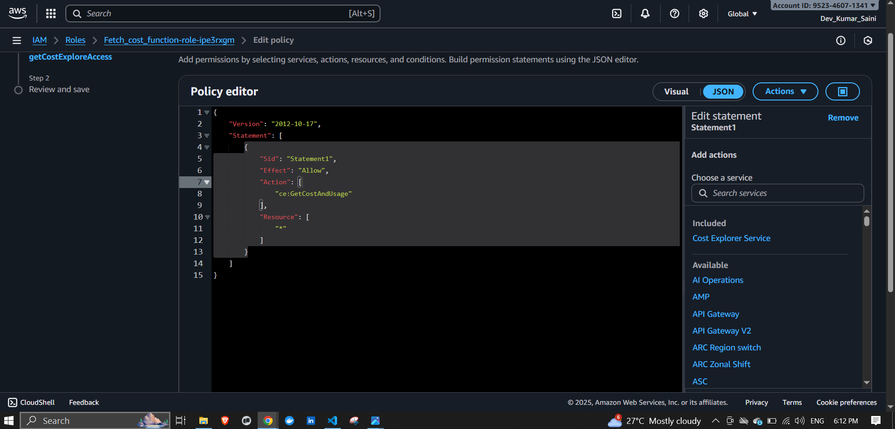


**13.After add all this permissions got to the lambda function and deploy it and test it**
---
**And make sure your timeout should be 30 sec at least. got and check in configure generate configuration**
---
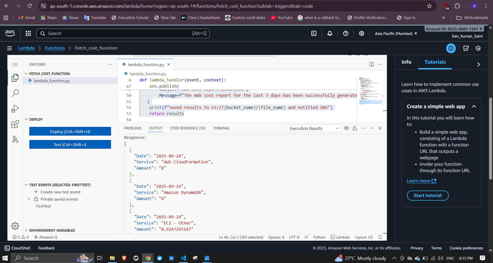


**14.Now check your s3 your file has been saved**
---
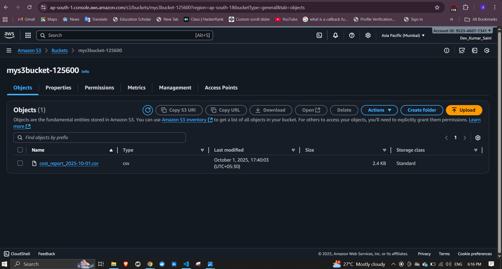

**15.check your SNS to . you'll get the notification**
---
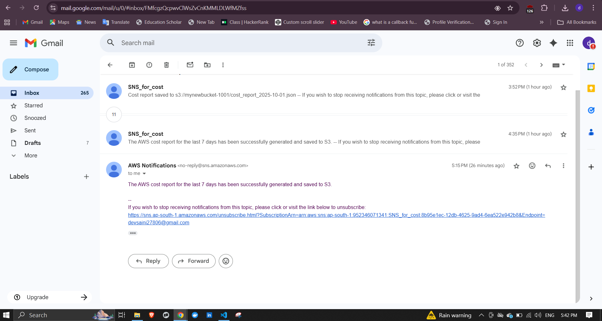

**16.check your Lambda Cloudwatch and logs**
---
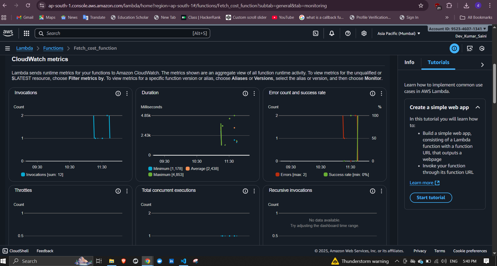

---
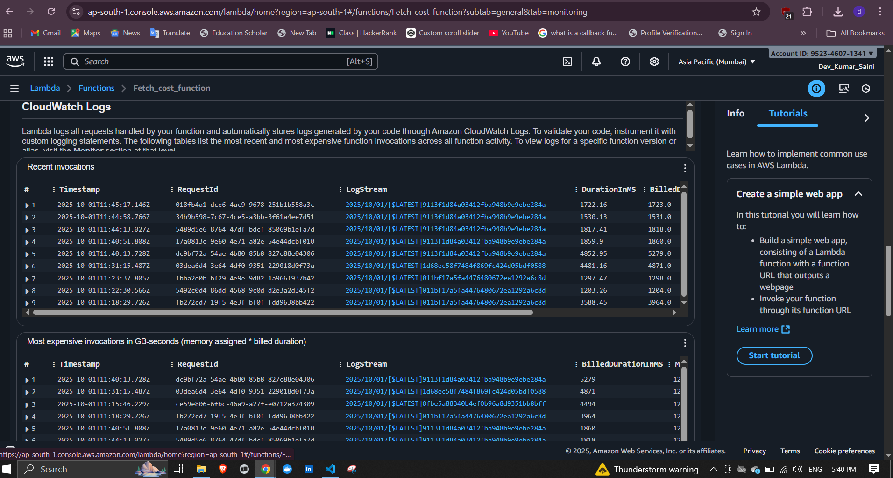

---

**17.Now go to Quicksight and create a account**
---
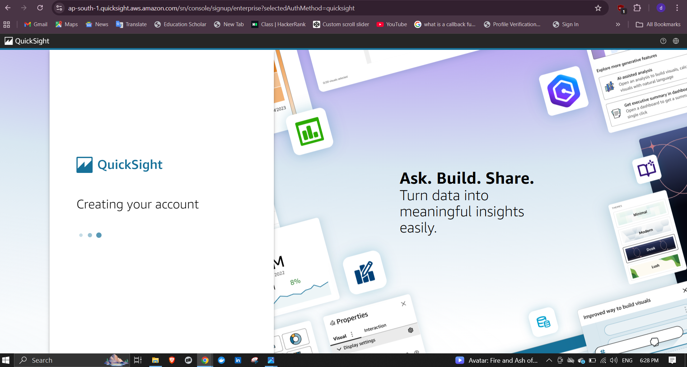

---

**18.Now go and give permission to S3 bucket**
---
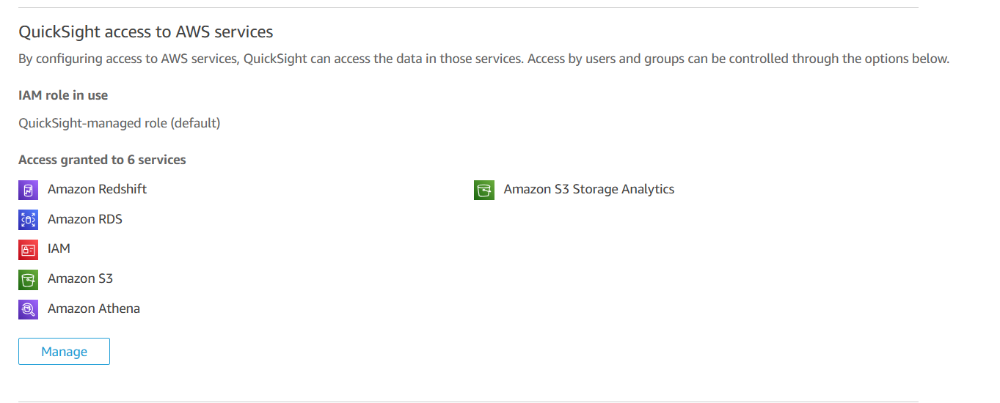

---

**19.Now go new analyst and new dashboard select amazon s3**
---
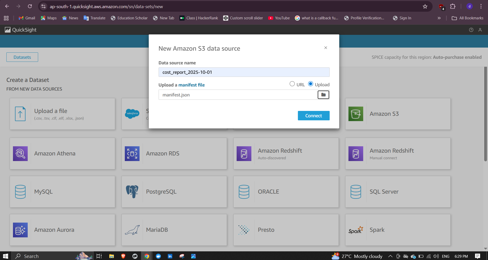

**upload the manifest file beacuse you want to give s3 url address to quicksight**
```bash
Save this file on local and upload it on quick sight then click connect
{
  "fileLocations": [
    {
      "URIs": [
        "https://mys3bucket-125600.s3.ap-south-1.amazonaws.com/cost_report_2025-10-01.csv" #give your s3 url 
      ]
    }
  ],
  "globalUploadSettings": {
    "format": "CSV",
    "delimiter": ",",
    "textqualifier": "'",
    "containsHeader": "true"
  }
}
```
---

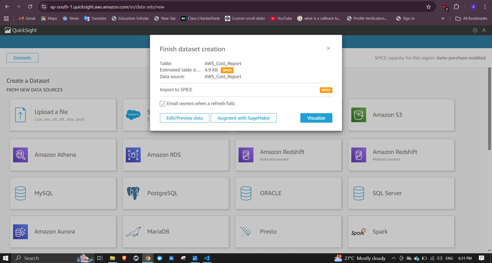

---
**20.Now design your dashboard accoding to you**
---
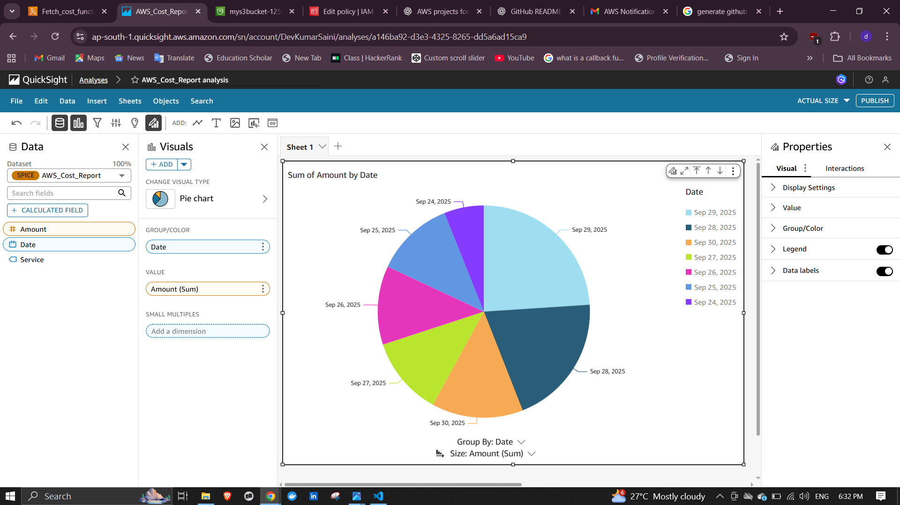

---
**21.Final dashboard look like this**
---
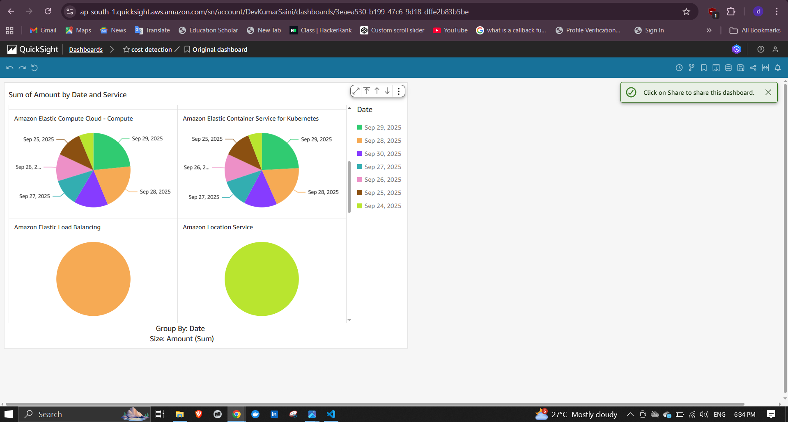


**22.And High alert that which resource consume high cost**
---
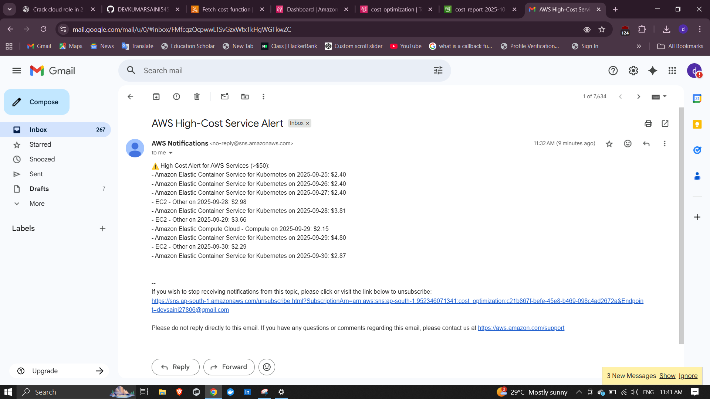


